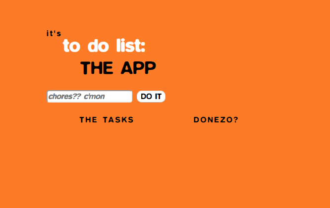
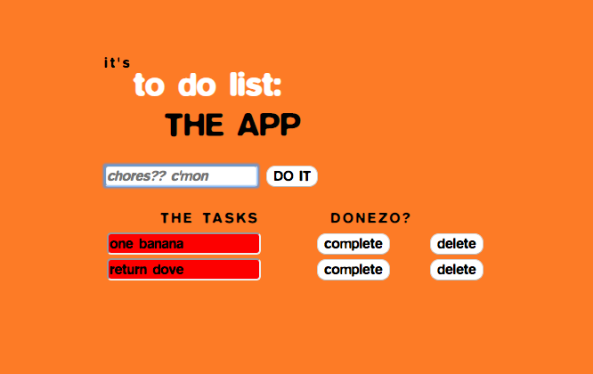

# It's To-Do List: The App
A simple to-do list application built when I was first learning and exploring MEAN stack.

 ## Screenshots

 ## Technologies used:
 
• Mongo \
• Express \
• AngularJS \
• Node.js \
• HTML/CSS \
• Bootstrap
